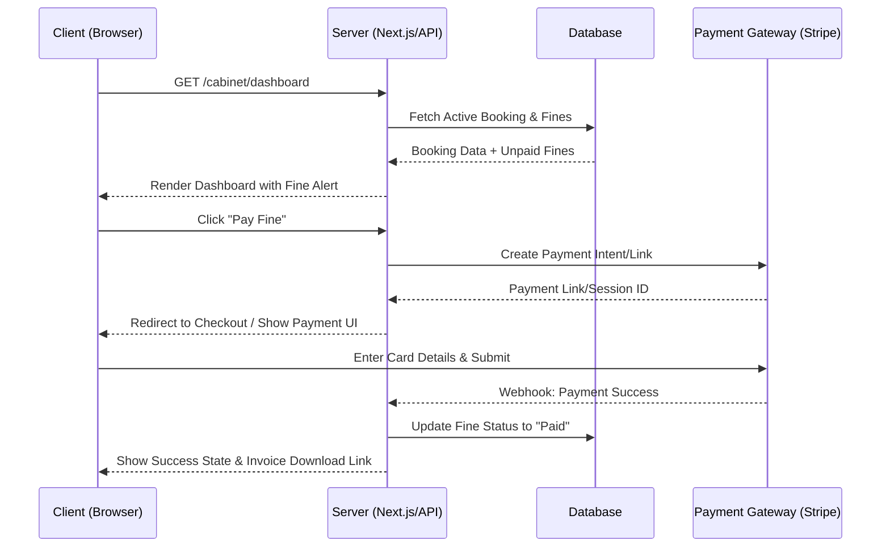

# 🚀 Renty Client Cabinet – Functional Requirements (User Stories)

Этот документ описывает ключевые функциональные требования к кабинету клиента (B2C) для маркетплейса Renty.

## 🌟 Основные сценарии (Core Features)

- **[CORE] Динамический контекстный дашборд (State-Aware):** Главный экран адаптируется под текущий этап Customer Journey:
  - *Нет брони:* Рекомендации на основе Wishlist и истории.
  - *Скоро старт (до 24ч):* QR-код/ваучер, карта локации Pick-up, погода, обратный отсчет.
  - *В аренде:* Кнопки "Продлить", "Сообщить о проблеме/ДТП", пробег.
- **[CORE] Управление активными бронированиями:** Детали заказа, статусы.
- **[CORE] Self-Service Damage Reporting (Фиксация повреждений):** Возможность при приемке или во время аренды сделать фото новой царапины и загрузить в систему, чтобы избежать спорных штрафов.
- **[CORE] Продление аренды:** В карточке активной брони клиент может нажать "Продлить", выбрать новые даты в календаре. Система на лету пересчитывает стоимость, и клиент оплачивает разницу.
- **[CORE] Управление дополнениями (Upsells):** Докупка услуг к оформленному заказу (детское кресло, расширенная страховка, доставка авто).
- **[CORE] Отмена бронирования:** Клиент может отменить заказ с учетом правил отмены.
- **[FINANCE] Финансовый хаб и онлайн-оплата:** Просмотр списка неоплаченных заказов с кнопкой "Оплатить сейчас". История транзакций. Скачивание инвойсов/чеков в PDF. Поддержка оплаты банковской картой и по Payment Link.
- **[FINANCE] Управление штрафами и доп. расходами:** Отдельный раздел или блок внутри брони для отображения штрафов (с прикрепленными фото/документами от полиции), счетов за платные дороги и других дополнительных инвойсов с возможностью их оплаты.
- **[USER] Вход и Авторизация:** Простая и современная авторизация без паролей (Passwordless). Поддержка входа через Email (получение одноразового кода), быстрый вход через социальные сети (Google Sign-In, Apple Sign-In), а также поддержка биометрии/Passkeys на устройствах пользователя.
- **[USER] Управление профилем:** Редактирование личных данных, отслеживание уровня лояльности (Loyalty Tier/Points) для удержания (LTV).
- **[USER] Омниканальная поддержка (Contextual Support):** Плавающий виджет помощи, который "понимает", где находится пользователь (например, если открыт инвойс, ИИ-бот сразу предлагает помощь по биллингу).
- **[USER] Удаление аккаунта (Soft Delete):** Клиент может инициировать удаление аккаунта. Фактически происходит "софт-удаление" (деактивация) с сохранением истории для финансовой отчетности.
- **[DATA] История заказов:** Таблица/список прошлых бронирований с возможностью "Повторить заказ".
- **[UI/UX] Избранное (Wishlist):** Доступ к автомобилям, добавленным в избранное в каталоге.

## 🗺 Happy Path (Идеальный путь)

1. Клиент авторизуется в кабинете.
2. Попадает на Dashboard, где сразу видит свою активную бронь (или сообщение о том, что активных броней нет, с призывом перейти в каталог).
3. Клиент кликает на активную бронь.
4. В деталях брони видит неоплаченный штраф (с прикрепленным фото).
5. Нажимает "Оплатить", выбирает способ оплаты (карта), успешно оплачивает.
6. Статус штрафа меняется на "Оплачено", клиент скачивает инвойс об оплате штрафа.

### Визуализация (Mermaid Sequence Diagram)

