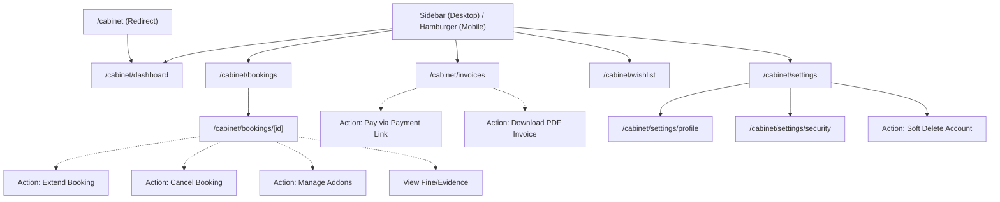

# 🗺 Sitemap & Page Structure

## Глобальная навигация

**Десктоп (Desktop):** Классический левый сайдбар (Sidebar). Он может быть статичным или сворачиваемым (collapsible) для экономии места. Содержит иконки и названия разделов. Сайдбар располагается под глобальным хедером маркетплейса `renty.com`, обеспечивая бесшовный опыт (Seamless Native).

**Мобильные устройства (Mobile):** Гамбургер-меню (Hamburger Menu) в верхнем навигационном баре. При клике выезжает шторка (Drawer/Off-canvas) со ссылками на разделов кабинета.

---

## Структура страниц (Глубокая детализация)

Все роуты кабинета будут находиться под префиксом `/cabinet` (или `/account`, в зависимости от настроек основного сайта).

- **`/cabinet` (Редирект):** Автоматически перенаправляет на `/cabinet/dashboard` (если авторизован) или на `/cabinet/login` (если нет).

- **`/cabinet/login` (Страница входа):**
  - **Цель:** Максимально простая авторизация без паролей.
  - **Ключевые блоки:**
    - Кнопки быстрого входа: "Continue with Google", "Continue with Apple".
    - Инпут для Email и кнопка "Send Code".
    - Стейт/Модалка ввода 4-6 значного кода из письма.
    - Опция входа по Passkey (биометрия).

- **`/cabinet/dashboard` (Главный экран - Дашборд):**
  - **Цель:** Быстрый обзор текущего состояния.
  - **Ключевые блоки (Dynamic Context):** 
    - *Если нет активной брони:* Блок лояльности, виджет "Забронировать снова" (из истории), рекомендации.
    - *Если бронь активна/скоро:* Карточка авто с кнопками "Продлить", "Отменить", "Сообщить о повреждении".
    - Виджет "Требует внимания" (Алерты о неоплаченных инвойсах или штрафах).

- **`/cabinet/bookings` (Мои бронирования):**
  - **Цель:** Список всех заказов.
  - **Ключевые компоненты:** Таблица или список карточек с фильтрацией (Активные, Завершенные, Отмененные).
  - **`/cabinet/bookings/[id]` (Детали бронирования):**
    - **Цель:** Полное управление конкретным заказом.
    - **Ключевые блоки:** 
      - Статус, даты, авто, локации pick-up/drop-off.
      - Модалка/Стейт: "Продлить аренду" (Выбор дат -> Перерасчет -> Оплата).
      - Модалка/Стейт: "Отменить бронь" (Показ правил отмены -> Подтверждение).
      - Секция "Дополнения (Upsells)": Добавление кресла, страховки к этой брони.
      - **Секция "Self-Service Damage":** Кнопка для загрузки фото царапин/повреждений с геолокацией.
      - Секция "Штрафы и доп. расходы": Список штрафов, привязанных именно к этой брони (с фото доказательствами и кнопкой "Оплатить").

- **`/cabinet/invoices` (Финансы: Инвойсы и Штрафы):**
  - **Цель:** Единый хаб для всех платежей.
  - **Ключевые блоки:**
    - Вкладки: "Все", "Неоплаченные", "Оплаченные".
    - Типы документов: Основные инвойсы за аренду, Штрафы (Fines), Доп. расходы (Tolls, Damage).
    - Действия: "Скачать PDF", "Оплатить" (переход на Payment Link/Stripe).

- **`/cabinet/wishlist` (Избранное):**
  - **Цель:** Хранение понравившихся авто.
  - **Ключевые блоки:** Сетка карточек автомобилей с кнопкой "Забронировать".

- **`/cabinet/settings` (Настройки профиля):**
  - **Цель:** Управление аккаунтом.
  - **Вложенные табы/роуты:**
    - **`.../profile`**: Редактирование имени, телефона, email. Загрузка документов (Права, ID).
    - **`.../security`**: Смена пароля.
    - **`.../danger-zone`**: Удаление аккаунта (Soft Delete) с модалкой подтверждения и предупреждением о сохранении финансовых данных.

## Визуальная карта сайта (Mermaid)

